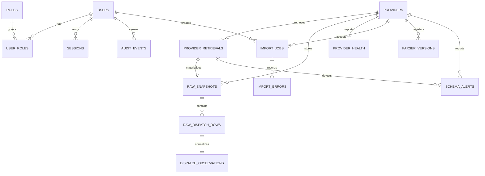

# Foundation and dispatch-ingestion data model

Phase 1 migration `0001_foundation` creates the governance and source-control core. Phase 2 migration `0002_dispatch_ingestion` adds versioned parser contracts, failure visibility, and source-preserving dispatch observations.

The provider and raw-snapshot records capture source authority, authorized-use state, schema/parser versions, snapshot hashes, retrieval status, failure state, and limitations. Raw dispatch rows preserve the source payload at row level; observations retain original wording/location and only add the versioned, source-faithful taxonomy family. Later migrations will add canonical incidents, parcels, candidates, features, labels, opportunities, and workflow records without mutating this provenance contract.
