# Foundation, dispatch-ingestion, incident-intelligence, and property-resolution data model

Phase 1 migration `0001_foundation` creates the governance and source-control core. Phase 2 migrations add versioned parser contracts, failure visibility, and source-preserving dispatch observations. Phase 3 migrations add a canonical incident ledger without mutating those source rows. Phase 4 migration `0007_property_resolution` adds manual/file property import lineage, immutable property source rows, current parcel projections, and explainable incident-to-parcel resolution without activating automated property retrieval.

```mermaid
erDiagram
  USERS ||--o{ USER_ROLES : has
  ROLES ||--o{ USER_ROLES : grants
  USERS ||--o{ SESSIONS : owns
  USERS ||--o{ AUDIT_EVENTS : causes
  PROVIDERS ||--o{ PROVIDER_RETRIEVALS : retrieves
  PROVIDERS ||--o{ RAW_SNAPSHOTS : stores
  PROVIDER_RETRIEVALS ||--|| RAW_SNAPSHOTS : materializes
  PROVIDERS ||--|| PROVIDER_HEALTH : reports
  PROVIDERS ||--o{ IMPORT_JOBS : accepts
  USERS ||--o{ IMPORT_JOBS : creates
  PROVIDERS ||--o{ PARSER_VERSIONS : registers
  PROVIDERS ||--o{ SCHEMA_ALERTS : reports
  PROVIDER_RETRIEVALS ||--o{ SCHEMA_ALERTS : detects
  RAW_SNAPSHOTS ||--o{ RAW_DISPATCH_ROWS : contains
  RAW_DISPATCH_ROWS ||--|| DISPATCH_OBSERVATIONS : normalizes
  IMPORT_JOBS ||--o{ IMPORT_ERRORS : records
  PROVIDERS ||--o{ CANONICAL_INCIDENTS : owns
  CANONICAL_INCIDENTS ||--o{ INCIDENT_OBSERVATION_LINKS : assembles
  DISPATCH_OBSERVATIONS ||--o{ INCIDENT_OBSERVATION_LINKS : supports
  RAW_DISPATCH_ROWS ||--o{ INCIDENT_OBSERVATION_LINKS : preserves
  CANONICAL_INCIDENTS ||--o{ INCIDENT_MATCH_DECISIONS : evaluates
  CANONICAL_INCIDENTS ||--o{ INCIDENT_EVIDENCE : explains
  CANONICAL_INCIDENTS ||--o{ INCIDENT_TIMELINE_EVENTS : timelines
  CANONICAL_INCIDENTS ||--o{ INCIDENT_MERGES : survivor_or_absorbed
  CANONICAL_INCIDENTS ||--o{ INCIDENT_SPLITS : original_or_new
  PROVIDER_RETRIEVALS ||--o| INCIDENT_PROCESSING_RUNS : processes
  PROVIDERS ||--o{ PROPERTY_MAPPING_PROFILES : maps
  PROVIDERS ||--o{ PROPERTY_IMPORTS : imports
  PROPERTY_IMPORTS ||--o{ PROPERTY_SOURCE_ROWS : contains
  PROPERTY_IMPORTS ||--o{ PROPERTY_FIELD_VALUES : versions
  PROPERTY_SOURCE_ROWS ||--o{ PROPERTY_FIELD_VALUES : proves
  PROVIDERS ||--o{ PARCELS : owns
  PARCELS ||--o{ PARCEL_ADDRESS_ALIASES : has
  PARCELS ||--o{ PROPERTY_BUILDINGS : contains
  CANONICAL_INCIDENTS ||--o{ INCIDENT_PROPERTY_MATCH_RUNS : resolves
  INCIDENT_PROPERTY_MATCH_RUNS ||--o{ INCIDENT_PROPERTY_CANDIDATES : ranks
  INCIDENT_PROPERTY_CANDIDATES ||--o{ PROPERTY_MATCH_FEATURES : explains
  CANONICAL_INCIDENTS ||--o{ PROPERTY_MATCH_DECISIONS : reviews
```

The provider and raw-snapshot records capture source authority, authorized-use state, schema/parser versions, snapshot hashes, retrieval status, failure state, acquisition mode, and limitations. Raw dispatch rows preserve the source payload at row level; observations retain original wording/location and only add the versioned, source-faithful taxonomy family. Incident links, decisions, evidence, timelines, and merge/split records are append-oriented audit structures; current assignment markers do not delete prior source relationships. Property imports retain raw payloads, row hashes, field transformations, effective/retrieved times, and explicit import lineage. Parcel aliases/buildings are current derived projections rebuilt for full replacement and rollback; their source imports and immutable rows remain inspectable. No opportunity, dashboard, or outreach table is part of Phase 4.
