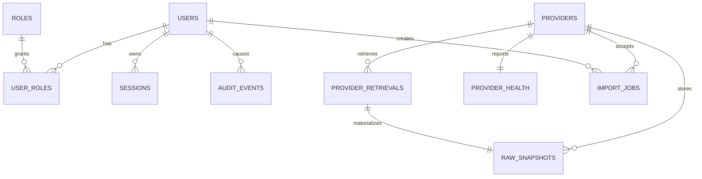

# Foundation data model

Phase 1 migration `0001_foundation` creates the governance and source-control core.

The provider and raw-snapshot records capture source authority, authorized-use state, schema/parser versions, snapshot hashes, retrieval status, failure state, and limitations. Later migrations will add incidents, observations, parcels, candidates, features, labels, opportunities, and workflow records without mutating this provenance contract.
