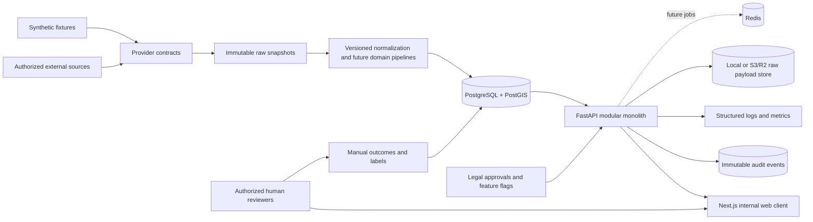

# System context and data flow



## Trust boundaries

1. External sources are untrusted input and must be authorized before activation.
2. Raw source data is retained separately from normalized records.
3. The API is the authorization boundary; the browser is not trusted.
4. Owner and organization data is restricted and is never automatically contacted.
5. Model outputs are governed artifacts, not facts.

## Phase 2 through Phase 6 request flow

```mermaid
sequenceDiagram
  participant U as Authorized user
  participant W as Web shell/API client
  participant A as FastAPI
  participant DB as SQL database
  U->>W: Sign in
  W->>A: POST /api/v1/auth/login
  A->>DB: Verify password and create session hash
  DB-->>A: Session
  A-->>W: Bearer token and role claims
  W->>A: GET /api/v1/providers
  A->>DB: Check session and role
  DB-->>A: Provider metadata
  A-->>W: Authorized provider list
  U->>W: Upload approved dispatch snapshot
  W->>A: POST /providers/{id}/snapshots + Idempotency-Key
  A->>DB: Persist retrieval, job, raw reference, parse result, health, audit
  A-->>W: Status, counts, parser/schema version, replay state
  U->>W: Start incident processing for a manual retrieval
  W->>A: POST /incidents/process/retrievals/{retrieval_id}
  A->>DB: Verify acquisition mode, assemble/link observations, persist decisions/evidence/timeline
  A-->>W: Processing counts, linkage/classification versions, review/contradiction counts
  U->>W: Preview/import a manually supplied property file
  W->>A: POST /properties/imports/preview or /properties/imports
  A->>DB: Verify provider type/attestation, persist raw file, source rows, projections, provenance, audit
  U->>W: Request property candidates or record human review decision
  W->>A: POST /incidents/{id}/property-matches or /property-matches/decisions
  A->>DB: Generate versioned candidates, preserve evidence, or persist reviewed decision
  A-->>W: Candidates, abstention, explanations, provenance, and review state
  U->>W: Request a versioned provisional opportunity score
  W->>A: POST /incidents/{id}/opportunity-score with provider and optional as-of
  A->>DB: Load registered release, source/property evidence, hard gates, and current human override
  A->>DB: Persist score run, feature contributions, source IDs, explanation, and predecessor
  A-->>W: Non-probability score, evidence tier, abstention/alert gate, provenance, and review controls
  U->>W: Review the internal command center or evidence workbench
  W->>A: GET /healthz and, in later authenticated workflow work, governed domain read endpoints
  A-->>W: API posture or source-preserving domain state; unavailable/empty states remain explicit
  A->>A: Local-only Sarasota worker checks approval decision and 900-second lease
  A->>A: Normal HTTPS GET, persist live_poll provenance, process, and audit outcome
```

Manual snapshot ingestion and Sarasota-only incident processing are the Phase 2/3 boundary. Phase 4 adds manual/file property workflows only. Phase 5 adds a non-probability evidence ranking over already imported Sarasota records; it does not add a source. Phase 6 adds a presentation-only internal dashboard with explicit loading, API-unavailable, empty, freshness, uncertainty, human-review, and live/manual-source states; it does not add a live map feed or fabricate domain records. Phase 7/8/9 add internal workflow, outcomes, analytics, and inactive learning contracts. Phase 10 adds deployment/operations controls around the same data flow: local or S3/R2 raw storage, chained audit events, health/readiness, metrics, retention tombstones, backup/restore, and migration release commands. The later local runtime activation adds only the official Sarasota normal-HTTPS polling adapter, a 900-second scheduler, a database lease, and explicit `live_poll` provenance. Local development may use `explicit_user_permission`; production/staging require a persisted approved `LegalApproval`. Official property automation remains disabled. The external approval gate is not removed or bypassed. No Boca radio, Broadcastify, empirical model, managed production activation, or outreach source is in scope.
