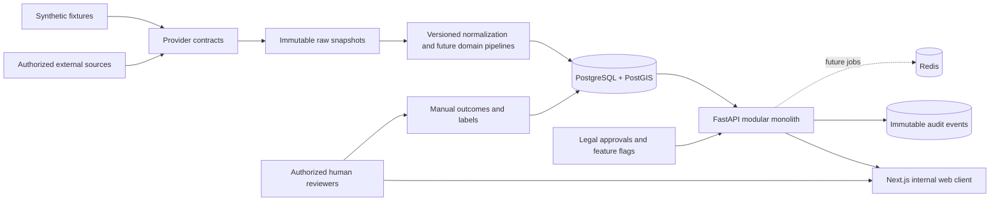
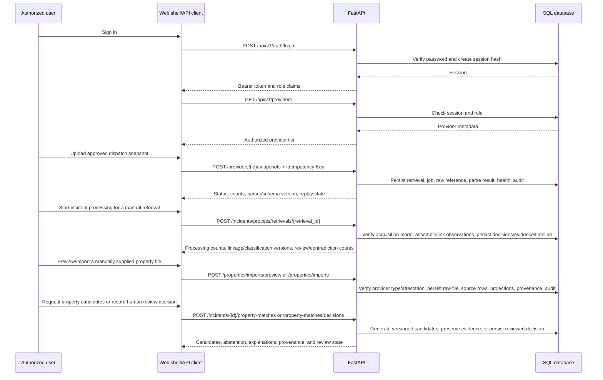

# System context and data flow

## Trust boundaries

1. External sources are untrusted input and must be authorized before activation.
2. Raw source data is retained separately from normalized records.
3. The API is the authorization boundary; the browser is not trusted.
4. Owner and organization data is restricted and is never automatically contacted.
5. Model outputs are governed artifacts, not facts.

## Phase 2 through Phase 4 request flow

Manual snapshot ingestion and Sarasota-only incident processing are the Phase 2/3 boundary. Phase 4 adds manual/file property workflows only. Dispatch retrievals carry `manual_snapshot` or `synthetic_fixture` provenance; official property imports require an explicit authorization attestation and synthetic fixture imports are labeled separately. Live-collected input and automated official property retrieval remain disabled. The external approval gate is not removed or bypassed. No Boca radio, Broadcastify, scoring, dashboard, or outreach source is in scope.
