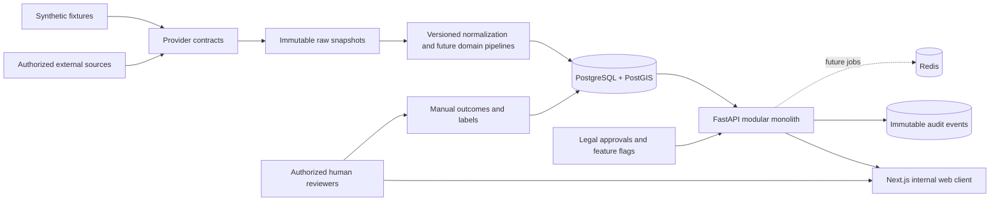
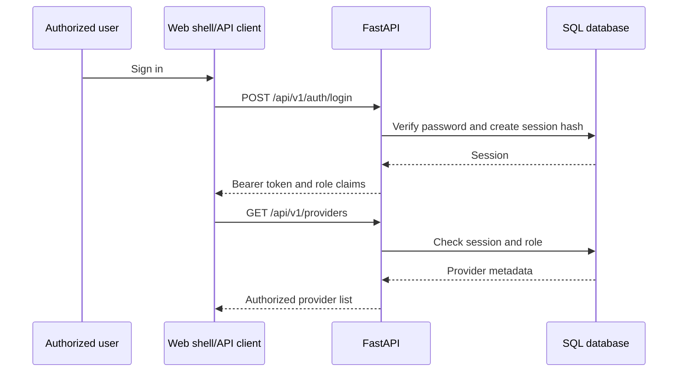

# System context and data flow

## Trust boundaries

1. External sources are untrusted input and must be authorized before activation.
2. Raw source data is retained separately from normalized records.
3. The API is the authorization boundary; the browser is not trusted.
4. Owner and organization data is restricted and is never automatically contacted.
5. Model outputs are governed artifacts, not facts.

## Phase 1 request flow

The raw provider retrieval and domain pipelines are not part of Phase 1; the registry contract is testable without pretending an external feed was retrieved.
